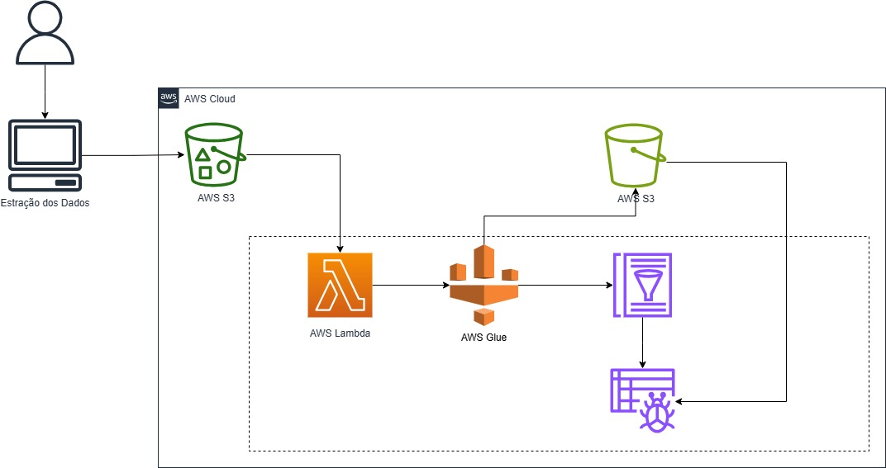

# Tech Challenge: Fase 2

## Visão Geral da Solução
Esse projeto impelmenta um pipeline batch de dados financeiros da B3 utilizando serviços da Amazon Web Services (AWS). O objetivo é construir uma solução robusta e escalável para ingestão, transformação e consulta de dados de ações e índices, seguindo as melhores práticas de engenharia de dados. O pipeline é projetado para operar diariamente, garantindo que os dados estejam sempre atualizados e prontos para análise.A arquitetura proposta envolve a extração de dados via yfinance, armazenamento em um bucket S3 na camada "raw", orquestração via AWS Lambda e AWS Glue para processamento ETL (Extract, Transform, Load), e disponibilização para consultas analíticas através do Amazon Athena, com o schema gerenciado pelo AWS Glue Data Catalog.Este guia fornece todo o código necessário, instruções de configuração, políticas IAM mínimas, permitindo adaptação da solução com agilidade.

## Arquitura

### Camadas
#### Camada 1 — Ingestão
Python script
coleta dados da B3
grava em Parquet no S3 raw

#### Camada 2 — Orquestração
evento do S3
Lambda dispara Glue Job

#### Camada 3 — Transformação
Glue ETL
aplica regras de negócio
grava refined

#### Camada 4 — Catálogo
Glue Catalog registra schema e partições

#### Camada 5 — Consumo
Athena consulta com SQL
